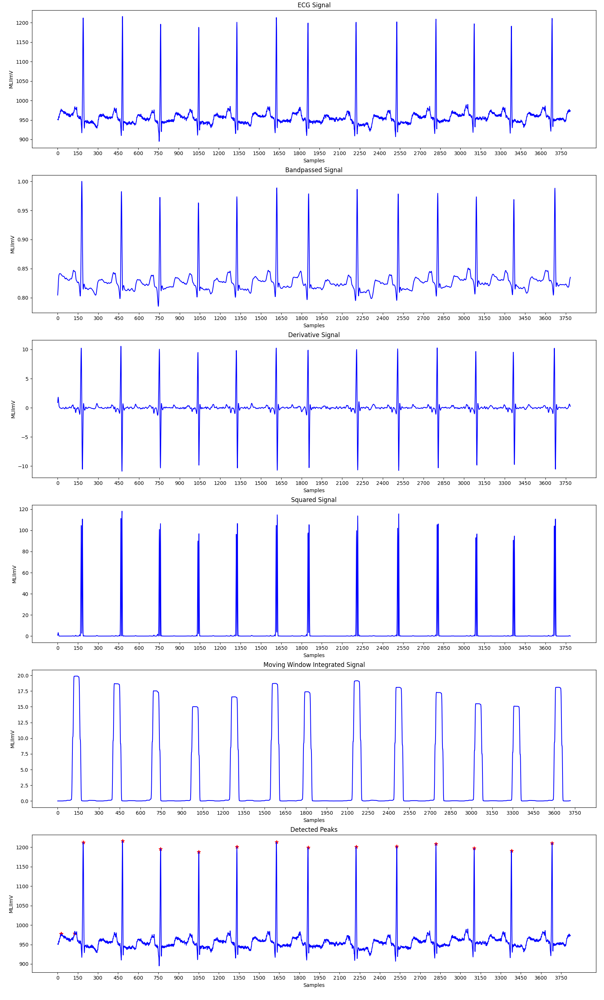
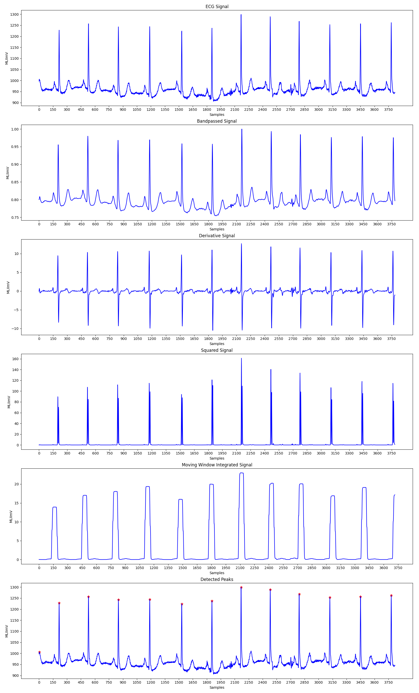
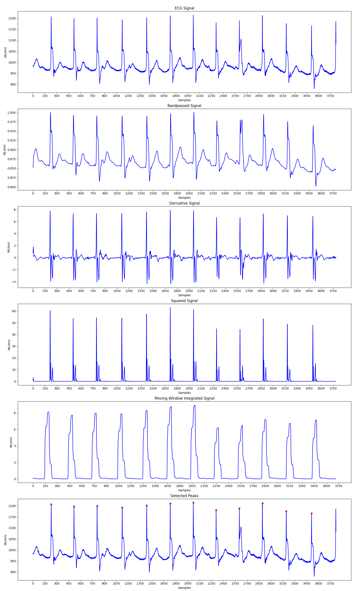
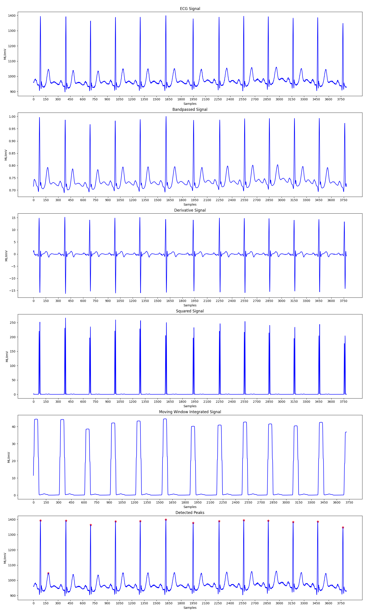
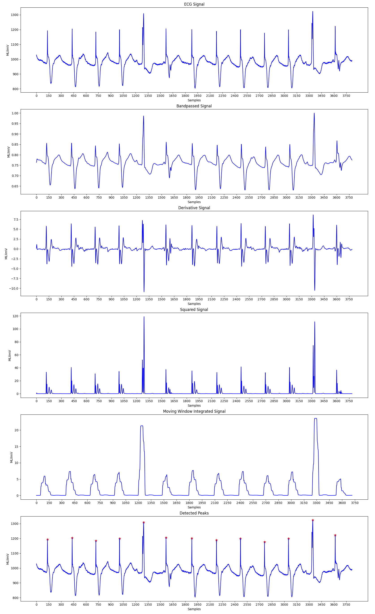
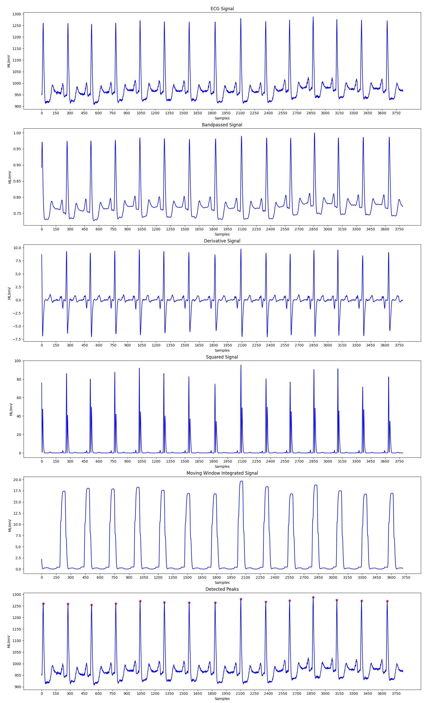
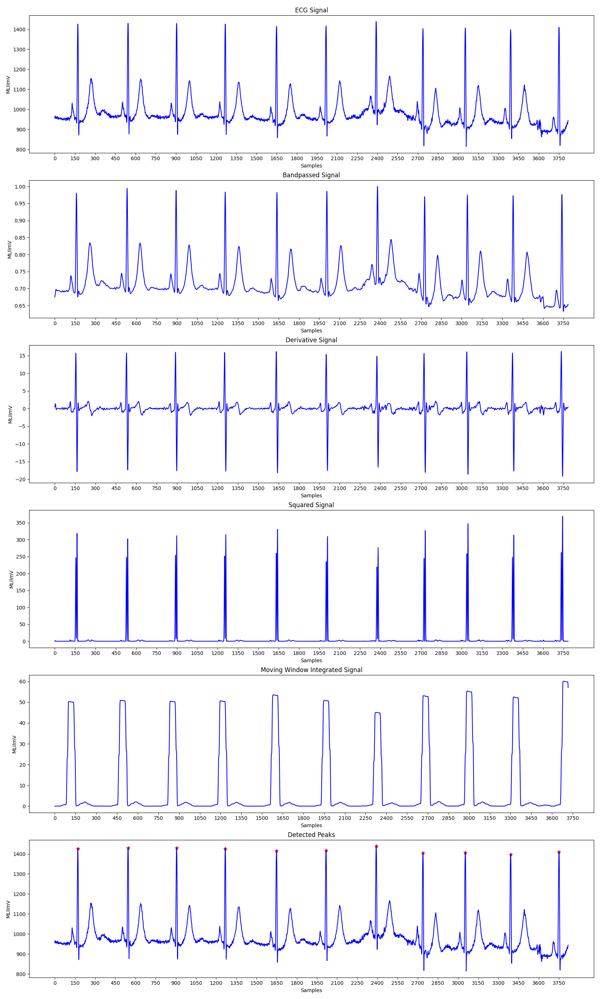
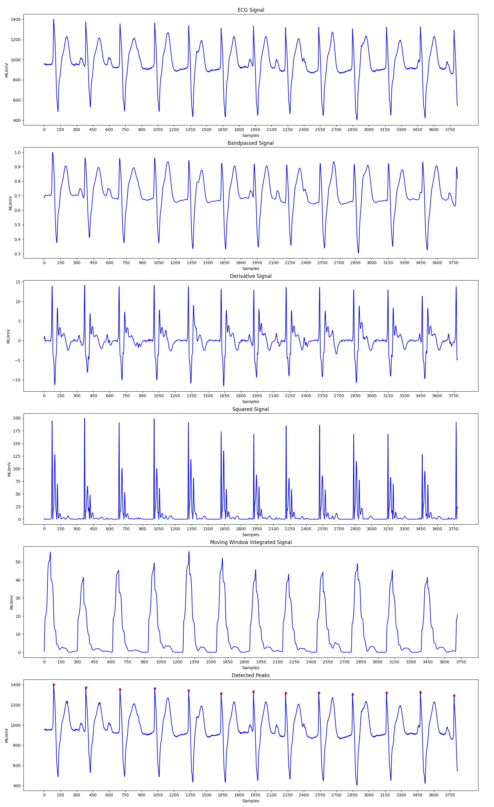
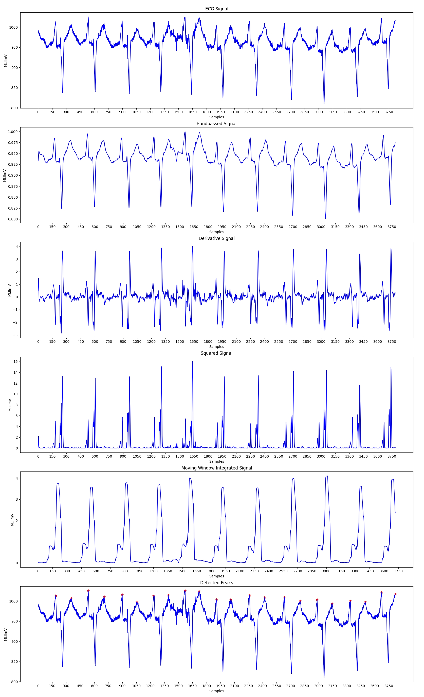
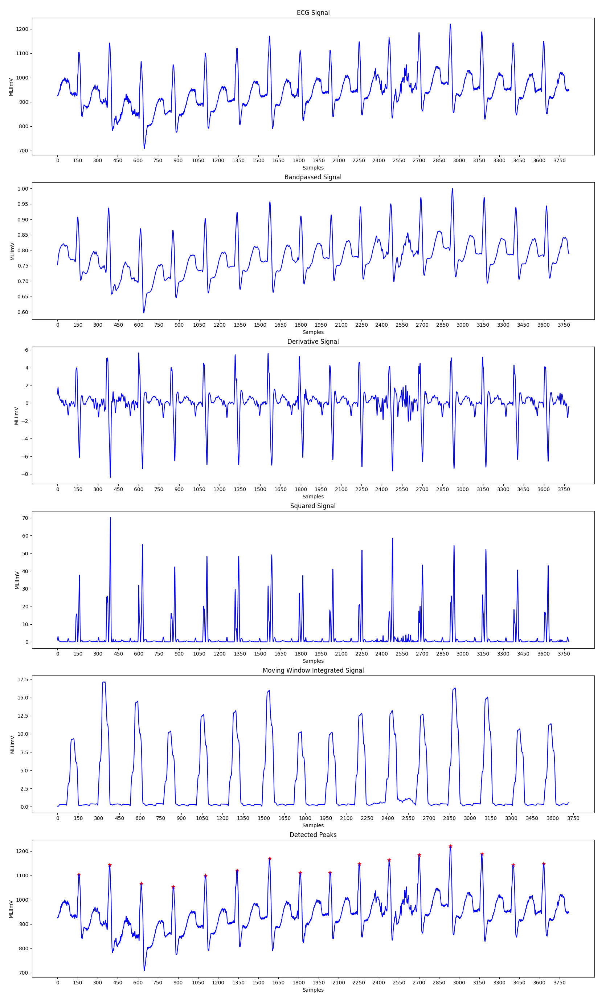

# Pan Tompkins QRS Detection ⭐

A dependable QRS recognition algorithm has numerous applications. A popular technique is the computer interpretation of the 12-lead ECG. Arrhythmia monitors are now widely used in coronary care units. Holter tape recording, which is widely used, necessitates a Holter scanning device that includes a QRS detector to analyse the tapes much faster than in real-time. Arrhythmia monitors for ambulatory patients that analyse the ECG in real time are currently in development. When an arrhythmia occurs, such a monitor can be programmed to immediately store an interval of the abnormal ECG for subsequent transmission to a central station where a physician can interpret it. Such a device necessitates highly accurate QRS recognition. False detection results in unnecessary data transmission to the central station or requires an extensive memory to store any ECG segments that are captured unnecessarily. As a result, an accurate QRS detector is an essential component of many ECG instruments.

## Pan Tompkins Algorithm 🔥

The Pan-Tompkins Algorithm is used to detect R waves from the QRS complex present in the ECG signals to determine the Heart Rate of an individual. The algorithm works by analysing the slope, amplitude and width of the QRS complexes present in the filtered ECG signal. The ECG signal is filtered so as to reduce noise and decrease detection thresholds, thereby increasing the sensitivity towards detection of the QRS complex. 

The algorithm can be divided into various phases, the first phase consists of applying the filtered on the input ECG signal, followed by peak detection in the filtered signal. The peak detection again works in three phases: Learning Phase 1, Learning Phase 2 and Detection. Learning Phase 1 is required to initialize the signal and noise thresholds followed by Learning Phase 2 in which the RR intervals and the RR limit values are initialized. The detection phase works by adjusting the thresholds appropriately and recognizing the QRS complexes. A dual threshold is used to increase the detection sensitivity along with the improvement in the signal to noise ratio by the bandpass filter.

### Implementation Details

## Filtering the ECG signal 

*  **Bandpass Filter:** Bandpass filter is used to attenuate the noise in the 
    input signal. To acheive a passband of 5-15 Hz, the input signal is first passed 
    through a low pass filter having a cutoff frequency of 11 Hz and then
    through a high pass filter with a cutoff frequency of 5 Hz, thus
    achieving the required thresholds.  

    The low pass filter has the recursive equation:  
      > y(nT) = 2y(nT - T) - y(nT - 2T) + x(nT) - 2x(nT - 6T) + x(nT - 12T)

    The high pass filter has the recursive equation:  
      > y(nT) = 32x(nT - 16T) - y(nT - T) - x(nT) + x(nT - 32T) 

* **Derivative Filter:** The derivative of the input signal is taken to obtain 
    the information of the slope of the signal. Thus, the rate of change
    of input is obtain in this step of the algorithm.  

    The derivative filter has the recursive equation:  
    > y(nT) = [-x(nT - 2T) - 2x(nT - T) + 2x(nT + T) + x(nT + 2T)]/(8T)

* **Squaring:** The squaring process is used to intensify the slope of the
    frequency response curve obtained in the derivative step. This
    step helps in restricting false positives which may be caused
    by T waves in the input signal.  

    The squaring filter has the recursive equation:  
    > y(nT) = [x(nT)]^2 

* **Moving Window Integration:** The moving window integration process is done 
    to obtain information about both the slope and width of the QRS complex.
    A window size of 0.15*(sample frequency) is used for more
    accurate results.  

    The moving window integration has the recursive equation:  
    > y(nT) = [y(nT - (N-1)T) + x(nT - (N-2)T) + ... + x(nT)]/N

    where N is the number of samples in the width of integration
    window.

## Peak Detection 

* **Fiducial Mark:** An approximate location of the QRS complex can be obtained in the initial phase of detection by sensing the rising edge of the integration waveform. Since, a peak is determined by the change in slope of the curve, the differentiated signal is used to determine the fiducial marks. 

* **Adjusting Thresholds:** Since the signal to noise ratio is improved by the bandpass filter, two sets thresholds are maintained to account for low threshold values. The higher thresholds of each set are used to detect peaks in the first analysis and the lower thresholds in the searchback process. The thresholds are adjusted accordingly to account for the detected signal peaks and noise values.  

* **Adjusting RR Interval and Limits:** To keep track of the time between two successive R peaks, two RR intervals are maintained. The first RR interval keeps track of the eight most recent beats while the second RR interval keeps track of the eight most recent beats having RR intervals that fall within the rate limits. Two averages pertaining to these RR intervals are calculated. These averages are then used to update the rate limits for the RR intervals. If a QRS compelx is not found within the calculated limits a searchback process is initiated to find the maximal peak value within the two calculated thresholds and this peak is taken to be a QRS candidate.

* **T Wave Identification:** If the calculated RR interval is less than 360 ms, which in this case is the sample frequency of the input ECG signal, then the maximal slope of this waveform is calculated. This is done to ensure that the interval in consideration is actually a QRS complex or a T wave. If the calculated maximal slope of the considered interval is less than half of the slope of the last QRS complex detected, then the current interval is considered to be a T wave. 

After the successfull detection of the R peaks, the heart rate of an individual can be calculated by considering the time difference between successive R peaks. The heart rate can be calculated as:   
> Heart Rate = 60/RR Interval (in seconds)

## Results :bar_chart:

### Record No. 100

#### Heart Rate: 94.5036 BPM

### Record No. 101

#### Heart Rate: 66.6667 BPM

### Record No. 102

#### Heart Rate: 72.3948 BPM

### Record No. 103

#### Heart Rate: 72.1202 BPM

### Record No. 104

#### Heart Rate: 74.6700 BPM

### Record No. 105

#### Heart Rate: 83.1225 BPM

### Record No. 106

#### Heart Rate: 60.6363 BPM

### Record No. 107

#### Heart Rate: 78.4795 BPM

### Record No. 108

#### Heart Rate: 130.9090 BPM

### Record No. 109

#### Heart Rate: 99.9383 BPM

## Instructions to Run :runner:

* The dataset is being downloaded from the given hashed link. 

* To run, open the colab file and select the image using the slider given. Then run the corresponding cells to get the results.

## References and Credits 💳

[1] Pan, J. and Tompkins, W., 1985. A Real-Time QRS Detection Algorithm. IEEE Transactions on Biomedical Engineering, BME-32(3), pp.230-236.
